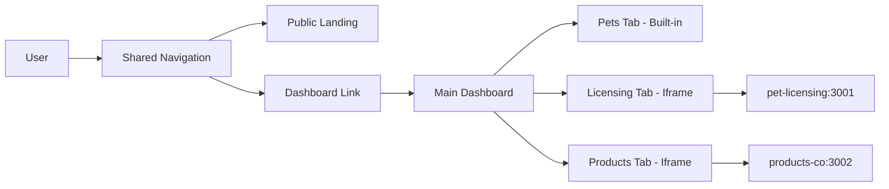

# All Pet Plus - Master Architecture

**Last Updated:** November 21, 2025  
**Version:** 2.0  
**Status:** Production Ready

> 🎯 **One comprehensive guide to understand the entire All Pet Plus system architecture.**

---

## Table of Contents

1. [Executive Summary](#executive-summary)
2. [System Overview](#system-overview)
3. [Technology Stack](#technology-stack)
4. [Architecture Patterns](#architecture-patterns)
5. [Core Services](#core-services)
6. [Data Architecture](#data-architecture)
7. [Communication Patterns](#communication-patterns)
8. [Deployment Architecture](#deployment-architecture)
9. [Security & Authentication](#security--authentication)
10. [Monitoring & Observability](#monitoring--observability)
11. [Development Workflow](#development-workflow)
12. [Quick Reference](#quick-reference)

---

## Executive Summary

All Pet Plus is a **hybrid architecture** combining:
- **Monorepo**: NX-powered with shared code (`@pet/*`)
- **Modular Monolith**: Backend organized by domain modules
- **Micro-Frontends**: Independent Next.js apps (iframe integration)
- **Extractable Microservices**: High-traffic modules can be separated
- **Type-Safe APIs**: 100% end-to-end via tRPC

### Key Metrics
- **Frontend Apps**: 2 (expandable to 10+)
- **Backend Services**: 1 modular monolith + extractable templates
- **Shared Libraries**: 4 (api, domain, messaging, shared)
- **Type Safety**: 100% (tRPC + TypeScript)
- **Time to Add Service**: 2-5 minutes (automated scaffold)

---

## System Overview

### High-Level Architecture

```
┌──────────────────────────────────────────────────────────────┐
│                        USERS                                  │
│           (Web Browsers, Mobile Apps, APIs)                   │
└─────────────────────┬────────────────────────────────────────┘
                      │
┌─────────────────────▼────────────────────────────────────────┐
│                   CDN / EDGE                                  │
│              (Vercel Edge Network)                            │
└─────────────────────┬────────────────────────────────────────┘
                      │
        ┌─────────────┴─────────────┐
        │                           │
┌───────▼────────┐         ┌────────▼───────┐
│  FRONTEND APPS │         │ MICRO-FRONTENDS │
│                │         │                 │
│  apps/web      │         │ pet-licensing   │
│  Port 3000     │         │ products-co     │
│                │         │ Port 3001-3XXX  │
│ - Storefront   │         │                 │
│ - Dashboard    │         │ - Standalone    │
│ - Builder      │         │ - Embedded      │
└───────┬────────┘         └────────┬────────┘
        │                           │
        └─────────┬─────────────────┘
                  │
            ┌─────▼─────┐
            │   tRPC    │  ← Type-safe API layer
            │  (libs/api)│
            └─────┬─────┘
                  │
        ┌─────────▼──────────┐
        │  BACKEND SERVICES  │
        │                    │
        │  Modular Monolith  │
        │  Port 4000         │
        │                    │
        │  Modules:          │
        │  - builder/        │
        │  - user/           │
        │  - order/          │
        │  - pet/            │
        │  - webhook/        │
        └─────────┬──────────┘
                  │
        ┌─────────┴─────────┐
        │                   │
┌───────▼────┐    ┌────────▼────────┐
│ PostgreSQL │    │  Redis + BullMQ │
│            │    │                 │
│ - Prisma   │    │ - Cache         │
│ - Pooling  │    │ - Sessions      │
│ - Replicas │    │ - Job Queue     │
└────────────┘    └─────────────────┘
        │
┌───────▼────────┐
│  External APIs │
│                │
│ - Shopify      │
│ - Stripe       │
│ - Clerk Auth   │
│ - Cloudinary   │
└────────────────┘
```

---

## Technology Stack

### Frontend
| Layer | Technology | Purpose |
|-------|------------|---------|
| Framework | Next.js 15 | App Router, SSR, SSG, ISR |
| Runtime | React 19 | UI components, hooks |
| Language | TypeScript 5.7 | Type safety |
| Styling | Tailwind CSS v4 | Utility-first CSS |
| State | Zustand | Client state management |
| Data Fetching | tRPC + React Query | Type-safe API calls |
| 3D Graphics | Three.js + R3F | Product customization |
| Animation | Framer Motion | Smooth transitions |
| UI Components | Radix UI + shadcn/ui | Accessible primitives |

### Backend
| Layer | Technology | Purpose |
|-------|------------|---------|
| Framework | Fastify 4 | High-performance HTTP |
| Language | TypeScript 5.7 | Type safety |
| ORM | Prisma 5 | Database access |
| Database | PostgreSQL 16 | Primary data store |
| Cache | Redis 7 | Caching + sessions |
| Queue | BullMQ | Background jobs |
| Auth | Clerk | Authentication |
| API Layer | tRPC | Type-safe API |

### Infrastructure
| Component | Technology | Purpose |
|-----------|------------|---------|
| Monorepo | NX 20.3 | Build system, caching |
| Package Manager | npm 10.7.0 | Workspace management |
| Containers | Docker | Local development |
| CI/CD | GitHub Actions | Automation |
| Frontend Deploy | Vercel | Edge hosting |
| Backend Deploy | Fly.io | Container hosting |
| Monitoring | Sentry + Datadog | Error tracking, metrics |

---

## Architecture Patterns

### 1. Monorepo Structure

```
all-pet-plus/
├── apps/              ← Frontend applications
│   ├── web/           → Port 3000 (main storefront + dashboard)
│   ├── pet-licensing/ → Port 3001 (micro-frontend)
│   └── products-co/   → Port 3002 (micro-frontend)
│
├── services/          ← Backend services
│   ├── backend/       → Port 4000 (modular monolith)
│   └── builder-service/ → Port 4002 (extractable template)
│
├── libs/              ← Shared libraries
│   ├── api/           → tRPC routers + procedures
│   ├── domain/        → Business logic + types
│   ├── messaging/     → Event bus (Redis Pub/Sub)
│   └── shared/        → Common utilities
│
├── docs/              ← Documentation
├── scripts/           ← Development automation
└── docker-compose.*.yml
```

### 2. Import Hierarchy

```typescript
// React Component
import { useEffect } from 'react';               // 1. React/Next
import { motion } from 'framer-motion';          // 2. External packages
import { trpc } from '@pet/api';                 // 3. Monorepo (@pet/*)
import { formatPrice } from '@pet/shared';       // 3. Monorepo (@pet/*)
import { Button } from '@/components/ui/button'; // 4. App-local (@/)
import { helper } from './utils';                // 5. Relative (./)
```

**Rules:**
- ✅ Use `@pet/*` for shared monorepo code
- ✅ Use `@/` for app-specific code
- ✅ Use `./` for same directory
- ❌ Never import `@pet/backend` from frontend

### 3. Micro-Frontend Pattern

**Two Integration Patterns:**

#### Pattern 1: Landing Page Only
- Public marketing pages
- Shared navigation with link to Dashboard
- No dashboard integration
- Example: Future insurance/training sites

#### Pattern 2: Landing + Dashboard Tab
- Public pages + dashboard management
- Shared navigation
- Dashboard content embedded via iframe
- Example: `pet-licensing`, `products-co`



### 4. Modular Monolith (Backend)

```
services/backend/src/
├── modules/           ← Domain modules (business logic)
│   ├── builder/
│   │   ├── service.ts      → BuilderService class
│   │   ├── routes.ts       → Fastify HTTP routes
│   │   └── index.ts        → Module exports
│   ├── user/
│   ├── order/
│   ├── pet/
│   └── webhook/
│
├── plugins/           ← Fastify plugins
│   ├── db.ts          → Prisma integration
│   ├── auth.ts        → Clerk JWT verification
│   ├── redis.ts       → Redis client
│   └── queue.ts       → BullMQ setup
│
├── jobs/              ← Background job processors
│   ├── preview-renderer.ts
│   ├── email-sender.ts
│   └── webhook-processor.ts
│
└── main.ts            ← Server bootstrap
```

**When to Extract to Microservice:**
- ✅ Traffic > 1000 req/min
- ✅ CPU usage > 70%
- ✅ Different scaling needs
- ✅ Separate deployment requirements

---

## Core Services

### Frontend Apps

#### apps/web (Port 3000)
**Purpose:** Main storefront and unified dashboard

**Key Features:**
- Landing pages (SSG/ISR)
- Product catalog (SSR)
- Custom builder (SSR + client state)
- User dashboard (SSR)
- Pet profiles management
- Order tracking

**Technology:**
- Next.js 15 (App Router)
- Server Components + Client Components
- Zustand for builder state
- tRPC for API calls
- Three.js for 3D preview

**Routes:**
```
/                    → Landing page (SSG)
/shop                → Product catalog (ISR)
/product/[handle]    → Product detail (SSR)
/builder             → Custom builder (SSR + client)
/dashboard           → User dashboard (SSR)
  /dashboard/pets    → Pet management (built-in)
  /dashboard/orders  → Order tracking (built-in)
  /dashboard/licensing → Licensing (iframe)
  /dashboard/products  → Products (iframe)
```

#### apps/pet-licensing (Port 3001)
**Purpose:** Pet licensing micro-frontend

**Features:**
- Public landing page
- License application form
- License management dashboard
- Renewal reminders
- Regulatory compliance

**Integration:**
- Standalone: `pet-licensing.harnesshero.com`
- Embedded: `harnesshero.com/dashboard/licensing` (iframe)

#### apps/products-co (Port 3002)
**Purpose:** E-commerce for all pet products

**Features:**
- Product catalog
- Multi-product builder (harness, collar, leash, etc.)
- Shopping cart
- Subscription boxes
- Order management

**Integration:**
- Standalone: `products.harnesshero.com`
- Embedded: `harnesshero.com/dashboard/products` (iframe)

### Backend Services

#### services/backend (Port 4000)
**Purpose:** Modular monolith with domain modules

**Modules:**

**1. Builder Module**
- Custom design CRUD
- Configuration validation
- Pricing calculation
- Preview generation queue

**2. User Module**
- User profile management
- Preferences storage
- Authentication integration

**3. Order Module**
- Order metadata tracking
- Status updates
- Timeline events
- Shipment tracking

**4. Pet Module**
- Pet profile CRUD
- Species/breed data
- Weight/age tracking
- Primary pet designation

**5. Webhook Module**
- Shopify webhook ingestion
- HMAC verification
- Event processing queue
- Retry logic

**Health Checks:**
```bash
GET /health        → Basic health
GET /health/db     → Database connection
GET /health/redis  → Redis connection
GET /health/queue  → BullMQ status
```

---

## Data Architecture

### Database Schema

```
┌─────────────┐
│ UserProfile │
├─────────────┤
│ id          │ PK
│ clerkId     │ UK (Clerk user ID)
│ email       │
│ role        │ (USER, ADMIN)
│ createdAt   │
└─────┬───────┘
      │ 1:N
      ├────────┐
      │        │
┌─────▼─────┐  │  ┌────────────┐
│ PetProfile│  │  │SavedDesign │
├───────────┤  │  ├────────────┤
│ id        │  │  │ id         │ PK
│ userId    │◄─┘  │ userId     │ FK
│ name      │     │ petId      │ FK (optional)
│ species   │  ┌──┤ configJson │ JSON
│ breed     │  │  │ status     │ (DRAFT, ACTIVE)
│ weight    │  │  │ previewUrl │
└─────┬─────┘  │  └────────────┘
      │ 1:N    │
      │        │
┌─────▼────────▼─┐
│   OrderMeta    │
├────────────────┤
│ id             │ PK
│ userId         │ FK
│ designId       │ FK (optional)
│ shopifyOrderId │ UK
│ status         │
│ totalPrice     │
│ shippingData   │ JSON
│ timeline       │ JSON
└────────────────┘
```

### Data Flow

```
User Action
    ↓
React Component (Frontend)
    ↓
tRPC Client Mutation/Query
    ↓
tRPC Router (libs/api)
    ↓
Service Class (Backend Module)
    ↓
Prisma ORM
    ↓
PostgreSQL Database
    ↓
← Type-Safe Response ←
    ↓
React Query Cache
    ↓
Component Re-render
```

---

## Communication Patterns

### 1. Frontend ↔ Backend (tRPC)

**Query (Read):**
```typescript
// Frontend Component
const { data, isLoading, error } = trpc.designs.list.useQuery({
  status: 'ACTIVE',
  limit: 20
});

// tRPC Router (libs/api/src/routers/designs.ts)
export const designsRouter = router({
  list: protectedProcedure
    .input(z.object({
      status: z.enum(['DRAFT', 'ACTIVE']),
      limit: z.number().min(1).max(100),
    }))
    .query(async ({ ctx, input }) => {
      return ctx.db.savedDesign.findMany({
        where: { userId: ctx.userId, status: input.status },
        take: input.limit,
      });
    }),
});
```

**Mutation (Write):**
```typescript
// Frontend Component
const createDesign = trpc.designs.create.useMutation({
  onSuccess: (data) => {
    router.push(`/dashboard/designs/${data.id}`);
  },
});

await createDesign.mutateAsync({
  name: 'My Design',
  configJson: { size: 'M', color: 'blue' },
});
```

### 2. Service ↔ Service (Event Bus)

```typescript
// Publisher (Order Service)
await eventBus.publish('order.created', {
  orderId: order.id,
  userId: order.userId,
  total: order.totalPrice,
});

// Subscriber (Email Service)
eventBus.subscribe('order.created', async (event) => {
  await sendOrderConfirmation(event.data);
});

// Subscriber (Analytics Service)
eventBus.subscribe('order.created', async (event) => {
  await trackConversion(event.data);
});
```

### 3. Micro-Frontend Communication (PostMessage)

```typescript
// Parent (Dashboard)
iframe.contentWindow.postMessage({
  type: 'UPDATE_USER',
  data: { userId, email }
}, 'http://localhost:3001');

// Child (Micro-Frontend)
window.addEventListener('message', (event) => {
  if (event.origin !== 'http://localhost:3000') return;
  
  if (event.data.type === 'UPDATE_USER') {
    setUser(event.data.data);
  }
});
```

---

## Deployment Architecture

### Environments

```
┌─────────────────────────────────────────────────────────┐
│                     PRODUCTION                          │
├─────────────────────────────────────────────────────────┤
│ Frontend:  Vercel Edge (Global CDN)                     │
│ Backend:   Fly.io US-East + US-West                     │
│ Database:  Managed PostgreSQL (Supabase/Neon)          │
│ Redis:     Managed Redis (Upstash/Fly.io)              │
│ Domain:    harnesshero.com                              │
└─────────────────────────────────────────────────────────┘

┌─────────────────────────────────────────────────────────┐
│                      STAGING                            │
├─────────────────────────────────────────────────────────┤
│ Frontend:  Vercel Preview                               │
│ Backend:   Fly.io Staging                               │
│ Database:  PostgreSQL (Staging)                         │
│ Redis:     Redis (Staging)                              │
│ Domain:    staging.harnesshero.com                      │
└─────────────────────────────────────────────────────────┘

┌─────────────────────────────────────────────────────────┐
│                    DEVELOPMENT                          │
├─────────────────────────────────────────────────────────┤
│ Frontend:  localhost:3000, 3001, 3002                   │
│ Backend:   localhost:4000                               │
│ Database:  Docker PostgreSQL                            │
│ Redis:     Docker Redis                                 │
│ Queue:     Docker BullMQ                                │
└─────────────────────────────────────────────────────────┘
```

### CI/CD Pipeline

```
Push to GitHub
    ↓
GitHub Actions Triggered
    ↓
┌─────────────────┐
│  Lint & Format  │
└────────┬────────┘
         ↓
┌─────────────────┐
│  Type Check     │
└────────┬────────┘
         ↓
┌─────────────────┐
│  Run Tests      │
│  - Unit         │
│  - Integration  │
└────────┬────────┘
         ↓
┌─────────────────┐
│  Build Projects │
│  - Libraries    │
│  - Apps         │
│  - Services     │
└────────┬────────┘
         ↓
┌─────────────────┐
│  Deploy Staging │
│  - Vercel       │
│  - Fly.io       │
└────────┬────────┘
         ↓
┌─────────────────┐
│  Smoke Tests    │
└────────┬────────┘
         ↓
    Pass? ──No──→ Rollback
         ↓ Yes
┌─────────────────┐
│ Manual Approval │
└────────┬────────┘
         ↓
┌─────────────────┐
│ Deploy Prod     │
└─────────────────┘
```

---

## Security & Authentication

### Authentication Flow (Clerk)

```
User clicks "Sign In"
    ↓
Redirect to Clerk
    ↓
User enters credentials
    ↓
Clerk validates
    ↓
Redirect back with JWT
    ↓
Store in HTTP-only cookie
    ↓
Frontend makes API request
    ↓
Backend verifies JWT with Clerk
    ↓
Extract userId from JWT
    ↓
Attach to request context
    ↓
Service uses ctx.userId
```

### Security Measures

| Layer | Protection | Implementation |
|-------|------------|----------------|
| Authentication | Clerk JWT | Middleware verification |
| Authorization | Role-based | User roles (USER, ADMIN) |
| Rate Limiting | Sliding window | Redis-backed counters |
| CSRF | SameSite cookies | Next.js built-in |
| XSS | Content Security Policy | Next.js headers |
| SQL Injection | Parameterized queries | Prisma ORM |
| Webhook Verification | HMAC signatures | Shopify/Stripe SDKs |
| Secrets | Environment variables | Never committed |
| Input Validation | Zod schemas | Server + client |

---

## Monitoring & Observability

### Error Tracking (Sentry)

```typescript
// Automatic capture
Sentry.init({
  dsn: process.env.SENTRY_DSN,
  environment: process.env.NODE_ENV,
  tracesSampleRate: 0.1,
});

// Manual capture
try {
  await riskyOperation();
} catch (error) {
  Sentry.captureException(error, {
    tags: { feature: 'builder' },
    user: { id: userId },
  });
}
```

### Metrics & Logs

**Application Metrics:**
- Request rate (req/s)
- Response time (P50, P95, P99)
- Error rate (%)
- CPU/Memory usage

**Business Metrics:**
- Builder completion rate
- Conversion rate
- Average order value
- Cart abandonment rate

**Logging:**
```typescript
// Structured logging
logger.info('Design created', {
  designId: design.id,
  userId: user.id,
  duration: Date.now() - startTime,
});
```

---

## Development Workflow

### Local Development

```bash
# 1. Start infrastructure
docker compose -f docker-compose.dev.yml up -d

# 2. Install dependencies
npm install

# 3. Setup database
cd services/backend
npm run db:migrate
npm run db:seed

# 4. Start all services
npm run dev
```

**Running Services:**
```bash
# All services
npm run dev

# Individual services
npm run dev:web       # Frontend only
npm run dev:backend   # Backend only
npx nx serve pet-licensing  # Specific micro-frontend
```

### Adding New Features

#### New Micro-Frontend (2 minutes)
```bash
npm run scaffold
# Select: Frontend App
# Enter: name (pet-insurance), port (3003)
# ✅ Auto-generated: App + Domain + tRPC + Docs
```

#### New Backend Module (10 minutes)
```bash
npm run scaffold
# Select: Backend Module
# Enter: name (ai-recommendations)
# ✅ Auto-generated: Module + Domain + tRPC
```

#### New Microservice (15 minutes)
```bash
npm run scaffold
# Select: Backend Service
# Enter: name (analytics-service), port (4003)
# ✅ Auto-generated: Service + Docker + Health checks
```

### Testing

```bash
# Unit tests
npm test

# E2E tests
npx nx e2e web

# Type checking
npm run typecheck

# Linting
npm run lint
```

---

## Quick Reference

### Port Allocation

| Service | Port | Purpose |
|---------|------|---------|
| apps/web | 3000 | Main storefront + dashboard |
| apps/pet-licensing | 3001 | Licensing micro-frontend |
| apps/products-co | 3002 | Products micro-frontend |
| services/backend | 4000 | Modular monolith |
| services/builder-service | 4002 | Extractable template |
| PostgreSQL | 5432 | Database |
| Redis | 6379 | Cache + Queue |

### Essential Commands

```bash
# Development
npm run dev                    # Start all
npm run dev:web                # Frontend only
npm run dev:backend            # Backend only

# Database
cd services/backend
npm run db:migrate             # Run migrations
npm run db:studio              # GUI
npm run db:seed                # Sample data

# Testing
npm test                       # All tests
npm run test:watch             # Watch mode
npx nx e2e web                 # E2E tests

# Building
npm run build                  # Build all
npm run typecheck              # Type check
npm run lint                   # Lint

# Scaffolding
npm run scaffold               # Create new service
```

### Import Patterns

```typescript
// ✅ Correct Order
import { useState } from 'react';           // 1. React
import { motion } from 'framer-motion';     // 2. External
import { trpc } from '@pet/api';            // 3. @pet/*
import { Button } from '@/components/ui';   // 4. @/
import { helper } from './utils';           // 5. ./

// ❌ Wrong
import { something } from '@pet/backend';   // Never import backend from frontend
```

### Decision Trees

**Should I create a Micro-Frontend?**
- ✅ Has public landing page
- ✅ Complex domain (>20 components)
- ✅ Independent deployment
- ✅ Separate team ownership

**Should I extract a Microservice?**
- ✅ Traffic > 1000 req/min
- ✅ CPU > 70% consistently
- ✅ Different scaling needs
- ✅ Separate technology stack

**Should I keep in Monolith?**
- ✅ Low/medium traffic
- ✅ Coupled with other modules
- ✅ Simple CRUD operations
- ✅ Shared database transactions

---

## Related Documentation

### Architecture Deep Dives
- [Flow Diagrams (Mermaid)](/docs/architecture/flow-diagrams.md) - Visual diagrams
- [Component Architecture](/docs/architecture/component-architecture.md) - React patterns
- [Database Scaling Plan](/docs/architecture/database-scaling-plan.md) - Scaling strategies
- [3D Preview System](/docs/architecture/3d-preview-system.md) - 3D rendering
- [Architecture Decision Records](/docs/architecture/adr/) - ADRs (4 decisions)

### Development Guides
- [Code Patterns](/docs/development/code-patterns.md) - TypeScript patterns
- [Testing Guide](/docs/development/testing-guide.md) - Testing strategies
- [Performance Guide](/docs/development/performance-guide.md) - Optimization
- [Dev Workflow](/docs/development/dev-workflow.md) - Daily workflow

### Setup & Configuration
- [How To Setup](/docs/how-to-setup.md) - Complete setup guide
- [Environment Setup](/docs/guides/environment-setup.md) - Environment variables
- [Database Setup](/docs/guides/database-setup.md) - Database configuration
- [Scaffold Script](/docs/guides/scaffold-script.md) - Automated scaffolding

### Operations
- [Deployment Guide](/docs/ops/deploy.md) - Production deployment
- [Backend Deployment](/docs/ops/backend-deployment.md) - Backend-specific

### API Reference
- [tRPC API Reference](/docs/api/trpc-api-reference.md) - Complete API docs
- [Frontend API](/docs/api/api-reference.md) - Frontend API
- [Backend API](/docs/api/backend-api-reference.md) - Backend endpoints

---

## Changelog

### Version 2.0 (November 21, 2025)
- ✅ Consolidated from multiple architecture docs
- ✅ Added comprehensive system overview
- ✅ Included all patterns in one place
- ✅ Added quick reference section
- ✅ Updated with products-co integration
- ✅ Added decision trees

### Version 1.0 (October 2025)
- Initial architecture documentation

---

**Last Updated:** November 21, 2025  
**Maintained By:** Architecture Team  
**Status:** Production Ready  
**Next Review:** January 2026

