# Architecture Flow Diagrams

**Last Updated:** October 23, 2025  
**Tool:** Mermaid (renders in GitHub, GitLab, VS Code)  
**Purpose:** Visual representation of system flows and architecture

---

## Table of Contents

1. [Authentication Flow](#authentication-flow)
2. [Design Creation Flow](#design-creation-flow)
3. [Order Processing Flow](#order-processing-flow)
4. [Micro-Frontend Integration](#micro-frontend-integration)
5. [Service Communication](#service-communication)
6. [Database Schema](#database-schema)
7. [Deployment Pipeline](#deployment-pipeline)

---

## Authentication Flow

### User Login with Clerk

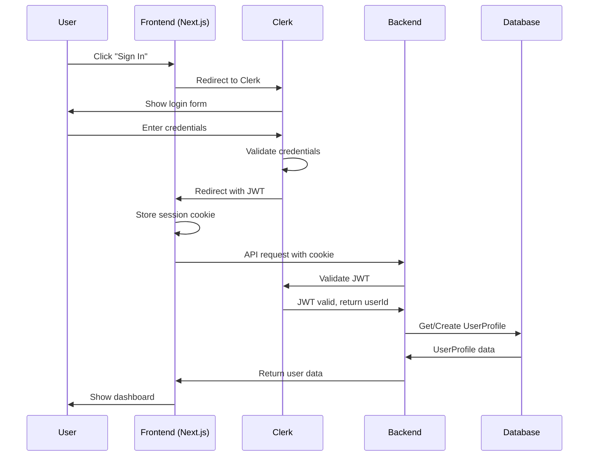

---

### tRPC Authenticated Request

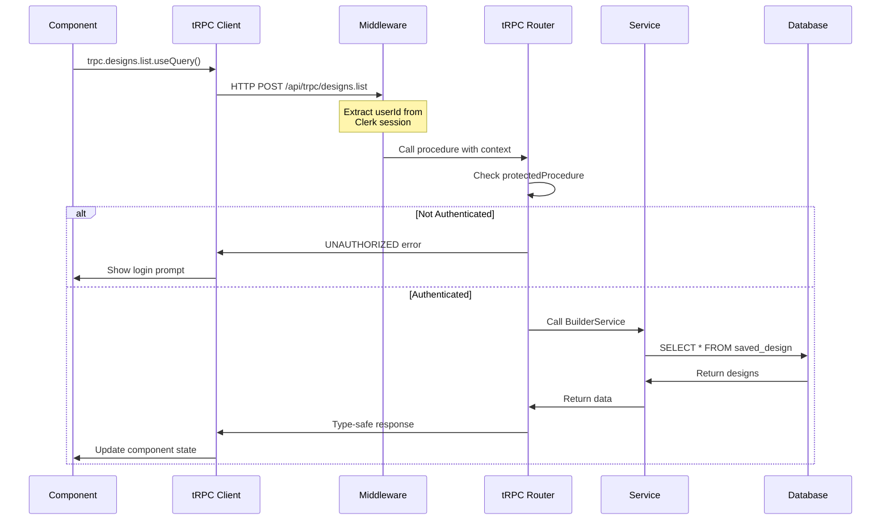

---

## Design Creation Flow

### Complete User Journey

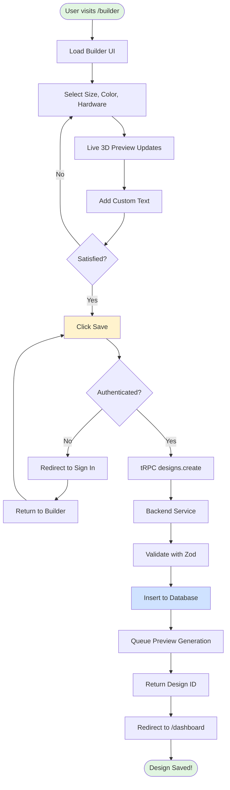

---

### Backend Design Creation

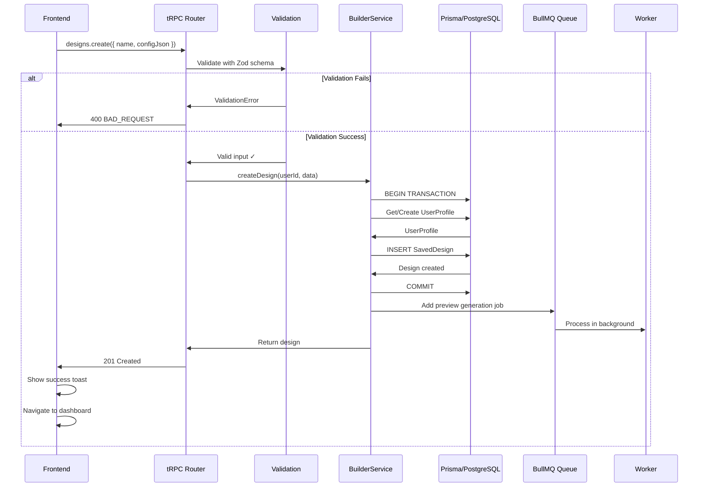

---

## Order Processing Flow

### Shopify Order Creation

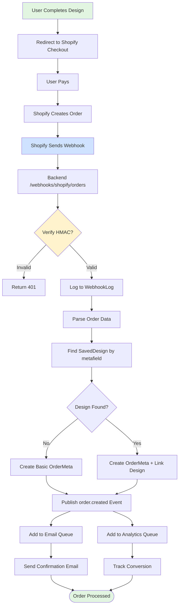

---

### Order Status Update Flow

```mermaid
stateDiagram-v2
    [*] --> PENDING: Order Created
    PENDING --> PROCESSING: Payment Confirmed
    PROCESSING --> PRODUCTION: Manufacturer Receives
    PRODUCTION --> QUALITY_CHECK: Production Complete
    QUALITY_CHECK --> SHIPPING: QC Passed
    QUALITY_CHECK --> PRODUCTION: QC Failed
    SHIPPING --> IN_TRANSIT: Shipped
    IN_TRANSIT --> DELIVERED: Delivery Confirmed
    DELIVERED --> [*]
    
    PENDING --> CANCELLED: Payment Failed
    PROCESSING --> CANCELLED: Inventory Issue
    CANCELLED --> [*]
    
    note right of PRODUCTION: Shopify webhook:<br/>fulfillment/create
    note right of SHIPPING: Shopify webhook:<br/>fulfillment/update
    note right of DELIVERED: Tracking API:<br/>delivery confirmed
```

---

## Micro-Frontend Integration

### Dashboard Tab Loading

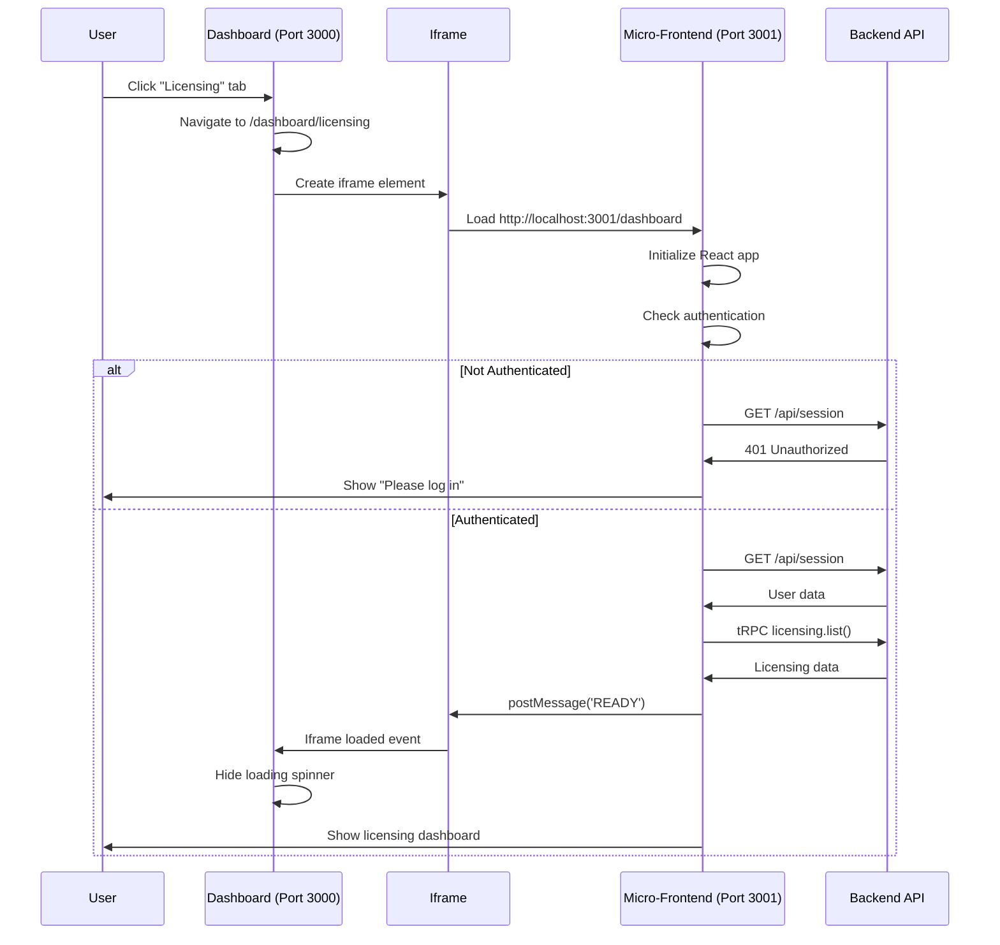

---

### PostMessage Communication

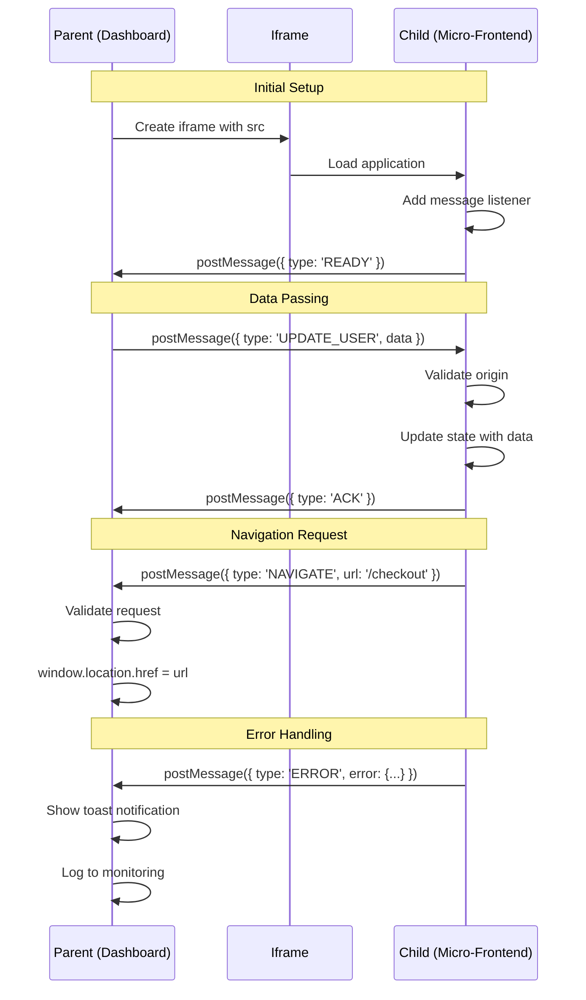

---

## Service Communication

### tRPC Request Flow

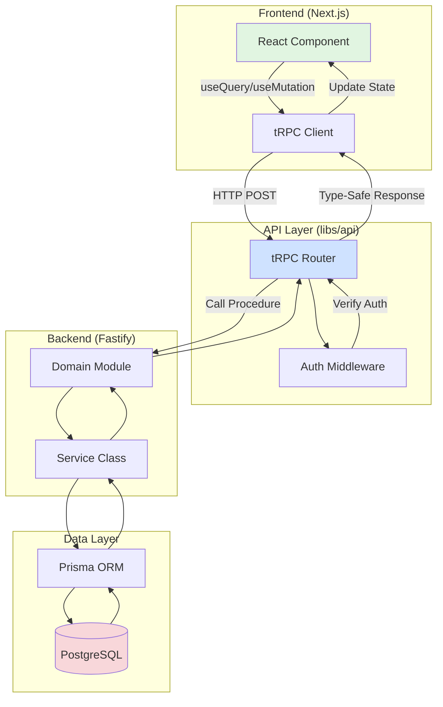

---

### Event-Driven Communication

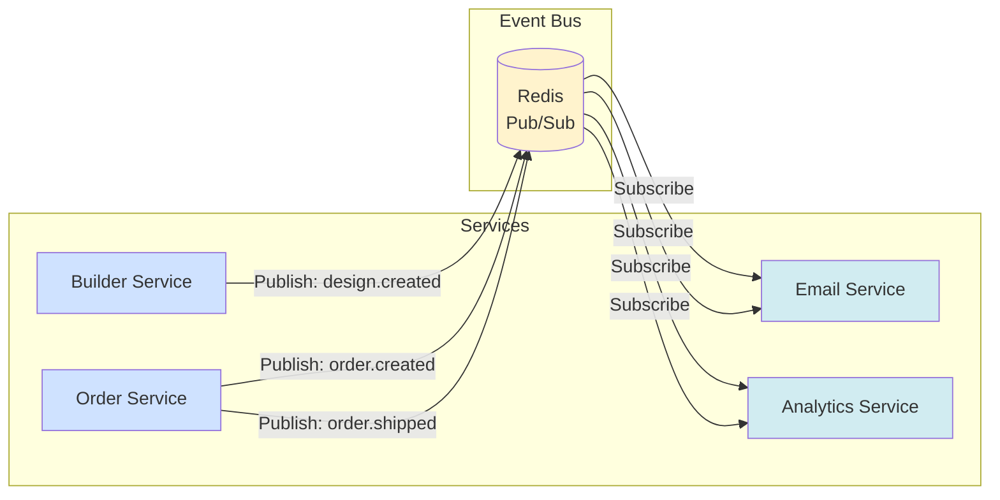

---

## Database Schema

### Core Entity Relationships

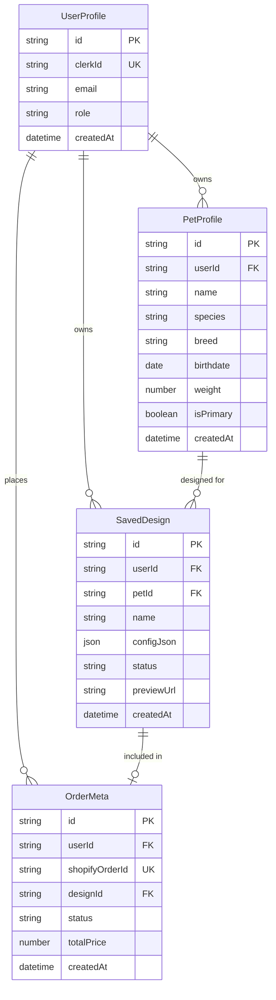

---

### Data Flow for Design

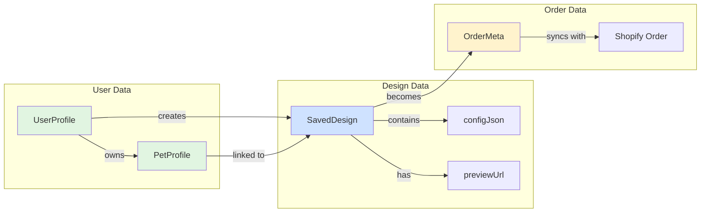

---

## Deployment Pipeline

### CI/CD Flow

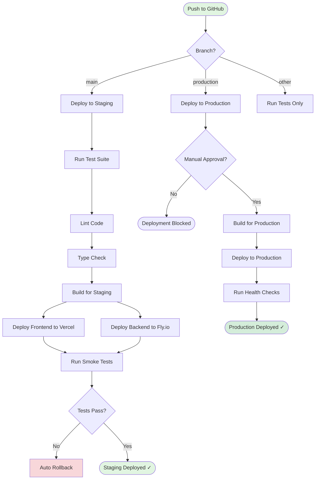

---

### Multi-Environment Architecture

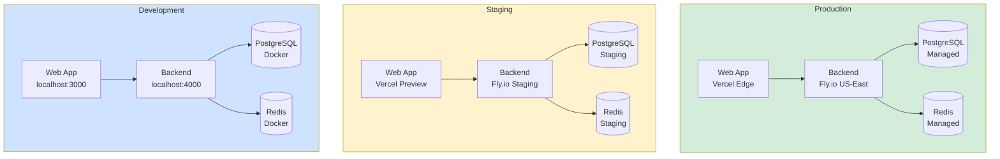

---

## Monorepo Structure

### Dependency Graph

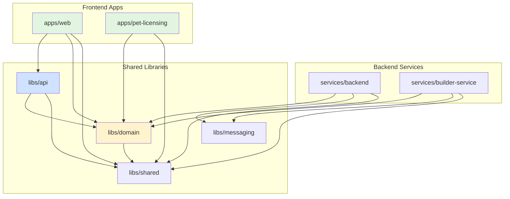

---

### Import Path Hierarchy

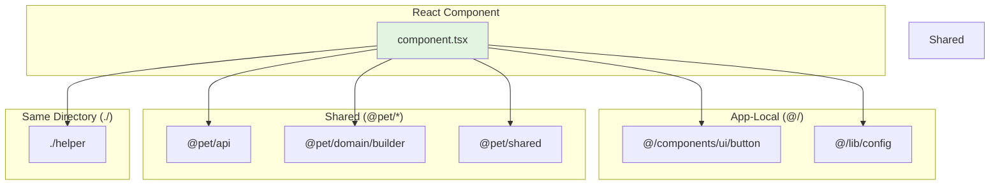

---

## Service Extraction Process

### Modular Monolith to Microservice

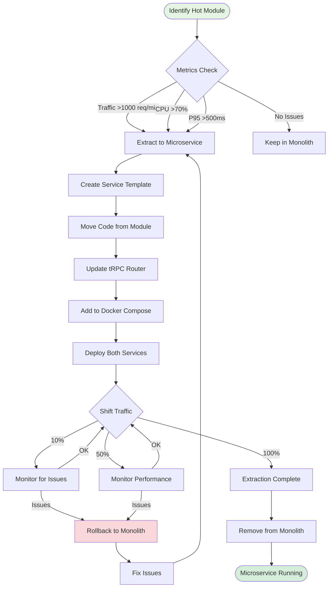

---

## Error Handling Flow

### Frontend Error Boundary

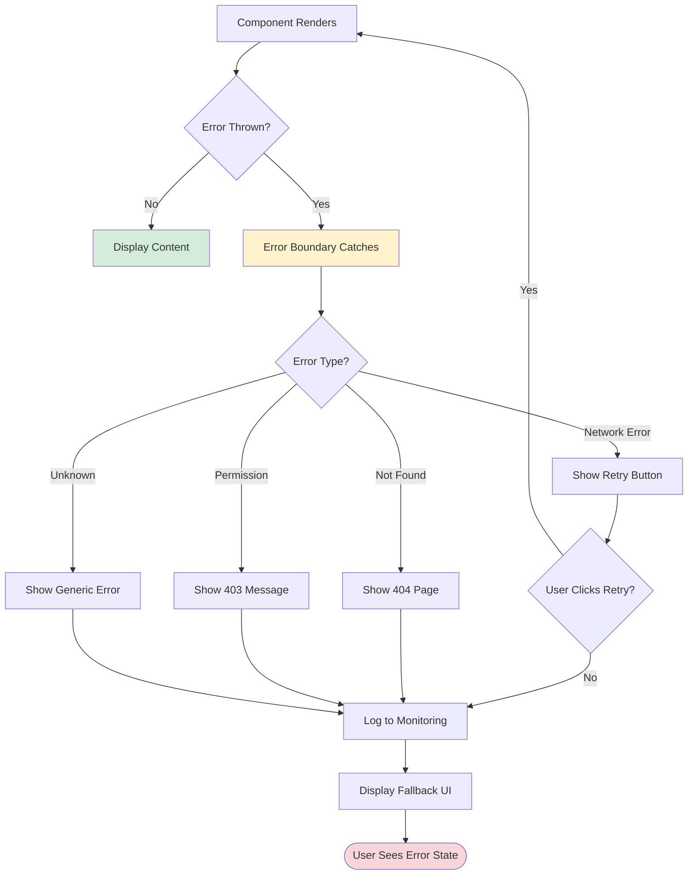

---

### API Error Handling

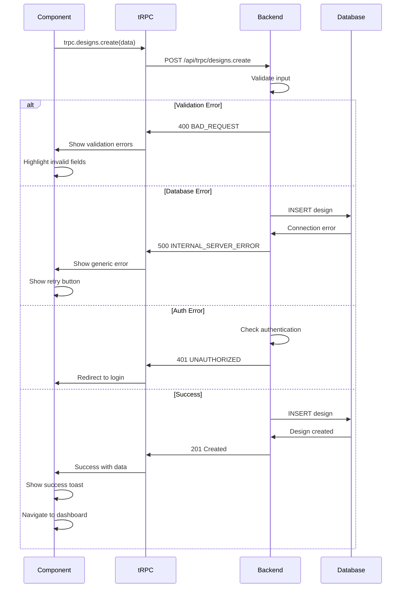

---

## Caching Strategy

### Multi-Layer Caching

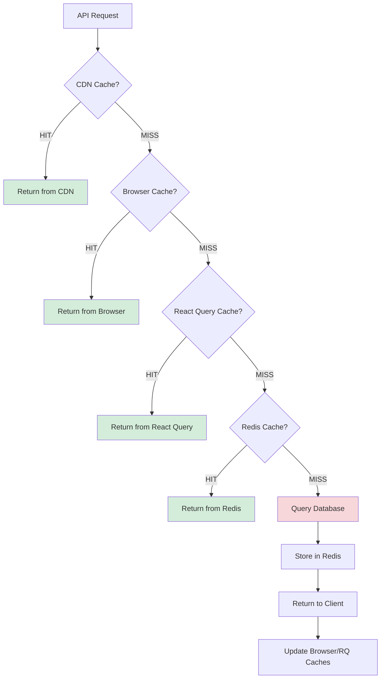

---

## Development Workflow

### Feature Development Flow

```mermaid
flowchart TD
    Start([New Feature Required]) --> Plan[Create Task/Issue]
    Plan --> Branch[Create Feature Branch]
    Branch --> Code[Write Code]
    
    Code --> Local[Test Locally]
    Local --> Pass{Tests Pass?}
    Pass -->|No| Fix[Fix Issues]
    Fix --> Local
    
    Pass -->|Yes| Commit[Commit Changes]
    Commit --> Push[Push to GitHub]
    Push --> PR[Create Pull Request]
    
    PR --> CI[CI/CD Runs]
    CI --> Checks{All Checks Pass?}
    
    Checks -->|No| Review[Fix CI Issues]
    Review --> Commit
    
    Checks -->|Yes| CodeReview[Code Review]
    CodeReview --> Approved{Approved?}
    
    Approved -->|No| Changes[Request Changes]
    Changes --> Code
    
    Approved -->|Yes| Merge[Merge to Main]
    Merge --> DeployStaging[Auto-Deploy to Staging]
    DeployStaging --> SmokeTest[Run Smoke Tests]
    
    SmokeTest --> SmokePass{Pass?}
    SmokePass -->|No| Hotfix[Create Hotfix]
    Hotfix --> Commit
    
    SmokePass -->|Yes| ProdReady[Ready for Production]
    ProdReady --> ManualDeploy[Manual Deploy to Prod]
    ManualDeploy --> Done([Feature Deployed ✓])
    
    style Start fill:#e1f5e1
    style Done fill:#d4edda
    style Fix fill:#f8d7da
```

---

## Viewing These Diagrams

### In GitHub/GitLab
Mermaid diagrams render automatically when viewing markdown files.

### In VS Code
Install the "Markdown Preview Mermaid Support" extension.

### In Documentation Site
Use a Mermaid-compatible static site generator (Docusaurus, VitePress, etc.).

### Export as Images
```bash
# Install mermaid-cli
npm install -g @mermaid-js/mermaid-cli

# Generate PNG
mmdc -i flow-diagrams.md -o diagrams/
```

---

## Related Documentation

- [Architecture Overview](/docs/architecture/architecture.md)
- [Architecture Visual Diagrams](/docs/analysis/architecture-visual-diagrams.md) - Text-based diagrams
- [Microservices Architecture](/docs/architecture/microservices-architecture.md)
- [Micro-Frontend Architecture](/docs/architecture/microfrontend-architecture.md)

---

**Last Updated:** October 23, 2025  
**Format:** Mermaid.js v10.x  
**Total Diagrams:** 14

